# LedgerFlow

### Three agents read a supplier bill, prove its GST arithmetic, and leave an accountant one decision

**Built by Team Logorhythms for the Claude Impact Lab Hackathon**

> **Do not type every invoice. Review the unclear ones.**

A supplier bill arrives as a WhatsApp photo or an emailed PDF. LedgerFlow runs it down a three-agent
line — one **reads** it, one **normalises and audits** it against GST rules and arithmetic, one
**presents** the result and produces the accounting export — and puts a human in front of only the
invoices that could not be proved automatically. Everything that reconciles goes straight through
untouched.

<p align="center">
  <a href="#1-the-problem">Problem</a> ·
  <a href="#2-the-solution">Solution</a> ·
  <a href="#3-the-three-agent-backend">Three agents</a> ·
  <a href="#4-the-workflow-end-to-end">Workflow</a> ·
  <a href="#5-the-interface">Interface</a> ·
  <a href="#6-architecture">Architecture</a> ·
  <a href="#7-run-locally">Run locally</a> ·
  <a href="#9-api">API</a> ·
  <a href="#10-demo-scenarios">Demo</a>
</p>

---

## 1. The problem

CA firms, distributors and small manufacturers do not receive invoices through a portal. They
receive them through WhatsApp, Gmail, a shared Drive folder, and a stack of paper on a desk. Every
single document then enters the same loop, by hand.

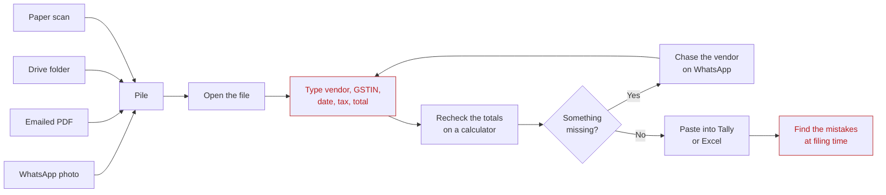

Three things make that loop expensive, and none of them are solved by better typing.

**The work is proportional to the number of bills, not to the number of problems.** A clean invoice
that reconciles perfectly costs the same three minutes of attention as the one with a broken GSTIN.

**The errors are found last.** A wrong GSTIN, a CGST/SGST split that should have been IGST, a total
that is ₹200 off — none of it surfaces until GSTR filing, when correcting it is at its most
expensive and input credit is at risk.

**Generic OCR does not close the gap.** Reading text off an image is the easy half.

| Plain OCR gives you | An accounting team actually needs |
| --- | --- |
| A blob of text, or loosely labelled key-values | Typed fields: vendor, GSTIN, date, HSN, taxable value, CGST/SGST/IGST, total |
| A confidence score per word | A verdict: is this bill postable, or not, and why |
| Whatever it guessed for an unreadable total | An explicit "not readable" that blocks approval |
| No opinion on tax law | GSTIN checksum, slab check, interstate vs intrastate check |
| No memory | "This is the same bill the vendor already sent on WhatsApp" |
| Text, every time | A file that imports into Tally, and an audit trail behind it |

And one hard constraint sits over all of it: **a model that invents a financial value is worse than
no model at all.** An invented total reconciles, passes review, gets approved, and becomes a wrong
entry in a filed return. Any design here has to make that structurally impossible rather than
unlikely.

---

## 2. The solution

LedgerFlow is an **accounting workflow**, not a chatbot. Three agents split the job so that reading,
judging and responding never happen in the same place — and so that the one agent capable of
inventing a number is never the one allowed to decide anything.

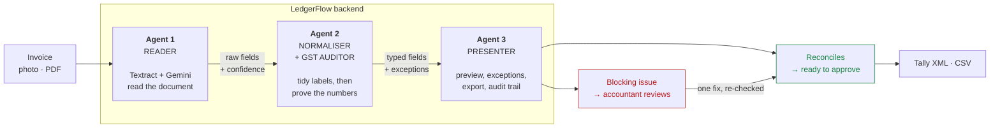

| Instead of | LedgerFlow does |
| --- | --- |
| Typing every invoice | Reviewing only the invoices that failed a check |
| Trusting raw OCR | Re-proving GSTIN, tax split, line items and totals in code |
| Hunting through chats for a missing GSTIN | Drafting the vendor follow-up, ready to send |
| Eyeballing arithmetic | Showing the sum: taxable + tax = computed, versus what the bill claims |
| Finding errors at filing time | Finding them at intake, before anything is posted |
| Copying data into accounting software | Downloading a Tally purchase voucher or a CSV |

**Why this is fast.** The three agents run as a single background pass the moment a file lands, so
the accountant never waits on a queue; the inbox is already sorted by the time they look at it.
Clean bills reach `READY_FOR_APPROVAL` without a human touching a field. Flagged bills arrive with
the failing check named, the arithmetic laid out, and the fix reduced to one input — the review page
re-runs Agent 2 on save, so a corrected total clears its own exception in a single round trip.

---

## 3. The three-agent backend

Each agent owns one stage, one contract, and one failure mode.

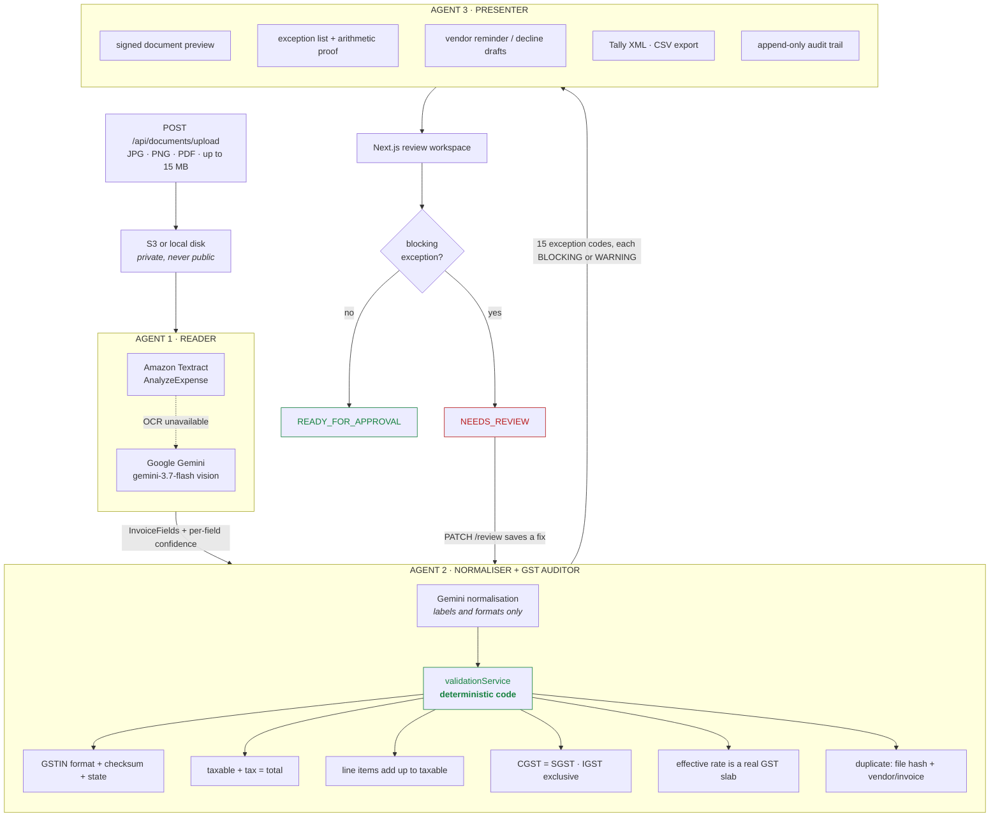

| | Agent 1 · Reader | Agent 2 · Normaliser + GST auditor | Agent 3 · Presenter |
| --- | --- | --- | --- |
| **Job** | Turn pixels into typed fields | Tidy the labels, then prove the numbers | Turn a verdict into something a human and Tally can use |
| **Input** | File bytes + MIME type | Raw fields + per-field confidence | Fields + exceptions + document history |
| **Output** | `InvoiceFields`, confidence, engine used | Exception list, severity, status, review note | Preview URL, review payload, email drafts, XML/CSV, audit events |
| **Uses a model** | Yes — Textract, or Gemini vision | Only for label tidying; the verdict is code | No |
| **Can it invent a value** | It transcribes; unreadable becomes `null` | No — a model number is accepted only where OCR had nothing | No |
| **Fails how** | Falls to the next engine down the ladder | A failed normalisation keeps the raw OCR fields | Export is refused unless a human approved |
| **Code** | `extractionService.ts`, `textractService.ts`, `geminiService.ts` | `geminiService.normalize()`, `validationService.ts` | `documentService.ts`, `exportService.ts`, `emailService.ts` |

> **On the word "agent".** Each of these is a bounded stage with one mandate, its own inputs, its own
> failure mode and its own fallback — not an open-ended loop that can call anything it likes. Agent 1
> and the normalisation half of Agent 2 call a model; the GST and arithmetic verdict inside Agent 2,
> and everything Agent 3 emits, is deterministic TypeScript. That split is the whole design: the
> agent that *can* hallucinate is never the agent that *decides*.

### Agent 1 · Reader

**Mandate: transcribe what is printed. Never compute, never complete, never guess.**

The reader picks the best engine available and degrades instead of failing, so an unconfigured laptop
and a fully provisioned AWS account run the same code path.

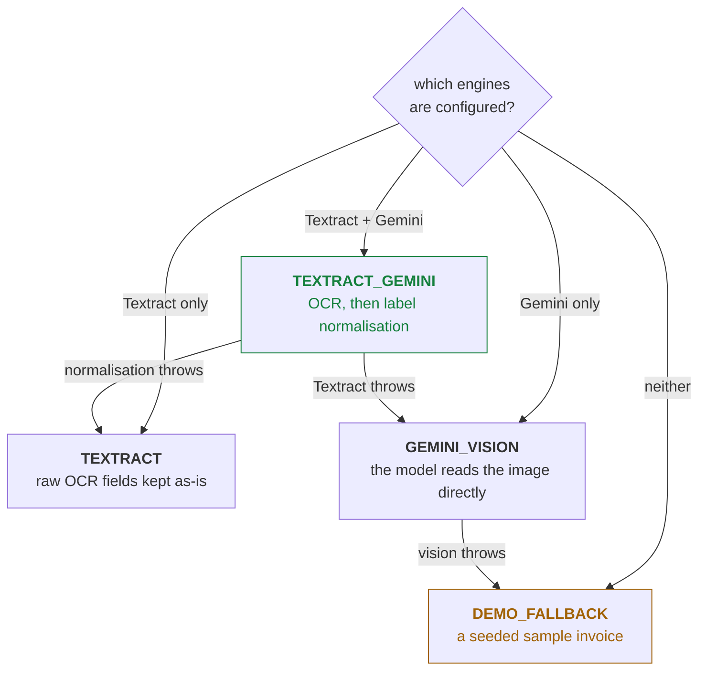

Whichever rung runs is recorded on the document and shown in the UI, so a reviewer always knows
which engine read the bill in front of them. The bottom rung is why a live demo cannot break: with
no AWS account and no API key, the full workflow still runs end to end on seeded invoices, clearly
labelled as sample extraction.

The prompt that governs the model is deliberately narrow — it is quoted here because it is the
contract, not a suggestion:

> Read the supplied invoice document and transcribe ONLY what is printed on it. Never invent or
> calculate a value. If a value is unreadable or absent, set it to `null` and list its name in
> `missingFields`. `gstin` is the SUPPLIER's 15-character GST number, uppercase (not the buyer's).

Every response is parsed through a Zod schema, and every number it returns is re-derived by
`parseAmount()` before it is stored. A malformed reply is an engine failure, not a bad invoice, so it
drops to the next rung rather than corrupting the record.

### Agent 2 · Normaliser and GST auditor

**Mandate: make the fields comparable, then prove them. This agent decides.**

It runs in two halves, and the boundary between them is the trust boundary of the whole system.

```mermaid
flowchart LR
    subgraph SOFT["half 1 · model, cosmetic only"]
      direction TB
      C1["trim vendor names"]
      C2["uppercase GSTIN"]
      C3["dates → YYYY-MM-DD"]
      C4["'₹1,23,456.00' → 123456"]
      C5["flag internally inconsistent fields"]
    end

    subgraph HARD["half 2 · code, load-bearing"]
      direction TB
      D1["GSTIN checksum"]
      D2["arithmetic identities"]
      D3["tax structure rules"]
      D4["duplicate detection"]
      D5["confidence threshold"]
    end

    SOFT --> HARD --> VERDICT{"any BLOCKING<br/>exception?"}
    VERDICT -->|yes| NR["NEEDS_REVIEW"]
    VERDICT -->|no| RA["READY_FOR_APPROVAL"]

    style HARD stroke:#15803d,color:#15803d
    style SOFT stroke:#a16207,color:#a16207
```

The merge rule between the halves is one line of policy, enforced in `mergeNormalized()`: the model
may clean a string or clear a value it distrusts, **but a number it produces is accepted only where
OCR had nothing at all.** It can never overwrite a figure that was actually read off the bill.

**The identities it proves.** All in `validationService.ts`, all in plain arithmetic, all within a ₹1
tolerance so that rounding on the bill is not treated as fraud:

```text
taxable value + CGST + SGST + IGST   =  invoice total          within ₹1
Σ (line item amounts)                =  taxable value          within ₹1
CGST                                 =  SGST                   within ₹0.50, intrastate only
IGST > 0                             ⇒  CGST = SGST = 0        a supply is interstate or not
(tax ÷ taxable) × 100                ∈  {0, 0.25, 3, 5, 12, 18, 28}   within 0.6 pp
vendor state (GSTIN digits 1-2)      ≠  place of supply        when IGST is charged
GSTIN                               ⊨  15-char format · valid state code · Luhn-style check digit
```

**The 15 checks it can raise.** Ten block approval outright; five are recorded as notes a reviewer
can accept and move past.

| Code | Severity | Fires when |
| --- | --- | --- |
| `GSTIN_MISSING` | **Blocking** | No supplier GSTIN — input credit cannot be claimed without it |
| `GSTIN_INVALID` | **Blocking** | Format, state code or check digit fails |
| `VENDOR_MISSING` | **Blocking** | No usable vendor name |
| `INVOICE_NUMBER_MISSING` | **Blocking** | No invoice number to key the entry on |
| `INVOICE_DATE_MISSING` | **Blocking** | Date absent or unreadable |
| `TOTAL_MISSING` | **Blocking** | Grand total unreadable |
| `TOTAL_MISMATCH` | **Blocking** | Taxable + tax ≠ total, or line items ≠ taxable |
| `TAX_MISMATCH` | **Blocking** | CGST ≠ SGST intrastate, or the effective rate is not a GST slab |
| `DUPLICATE_INVOICE` | **Blocking** | Same file hash, or same vendor + invoice number already recorded |
| `EXTRACTION_FAILED` | **Blocking** | No engine could read the document at all |
| `TAX_SPLIT_INVALID` | Warning | IGST charged alongside CGST/SGST, or IGST within one state |
| `INVOICE_DATE_FUTURE` | Warning | Date is in the future — usually a misread year |
| `LINE_ITEMS_MISSING` | Warning | No line items, so quantities cannot be cross-checked |
| `LOW_CONFIDENCE` | Warning | Extraction confidence below 75% |
| `SIGNATURE_MISSING` | Warning | Signature or seal area detected as blank |

A document with one or more blocking exceptions becomes `NEEDS_REVIEW` and **cannot be approved or
exported** until a human resolves it. Warnings alone let it through to `READY_FOR_APPROVAL`, with the
notes attached to the record.

### Agent 3 · Presenter

**Mandate: make the verdict legible, make the response ready, let nothing leave without approval.**

The presenter never re-reads the document and never re-judges it. It assembles.

| What it assembles | Detail |
| --- | --- |
| **Document preview** | A short-lived signed S3 URL, or a local stream. The original file is never made public. |
| **Exception list** | Each check as a card: code, severity, plain-English cause, and the field it points at. |
| **Arithmetic proof** | The sum shown line by line — taxable, CGST, SGST, computed total, total on the bill — so the reviewer verifies a claim instead of trusting a badge. |
| **Editable fields** | Every field with its extracted value, formatted in Indian style, ready to correct. Saving re-runs Agent 2. |
| **Vendor reminder** | A drafted follow-up naming exactly the fields that could not be read, ready to send or copy. |
| **Decline notice** | A drafted rejection with the reason, sent when an invoice is rejected. |
| **Accounting export** | A Tally-compatible purchase-voucher XML and a flat CSV, generated from the approved snapshot. |
| **Audit trail** | Append-only: received → read → notes → corrected → approved → exported, each with actor and timestamp. |

Two rules are enforced here rather than in the UI, because a UI can be bypassed and an API cannot:
**export is refused unless the document is `APPROVED`**, and **an approved document is locked** — it
cannot be re-extracted or silently re-edited afterwards. Emails degrade the same way the extractors
do: with SMTP configured they are delivered, without it they are simulated and recorded in the audit
trail so the demo stays self-contained.

### One invoice, all three agents

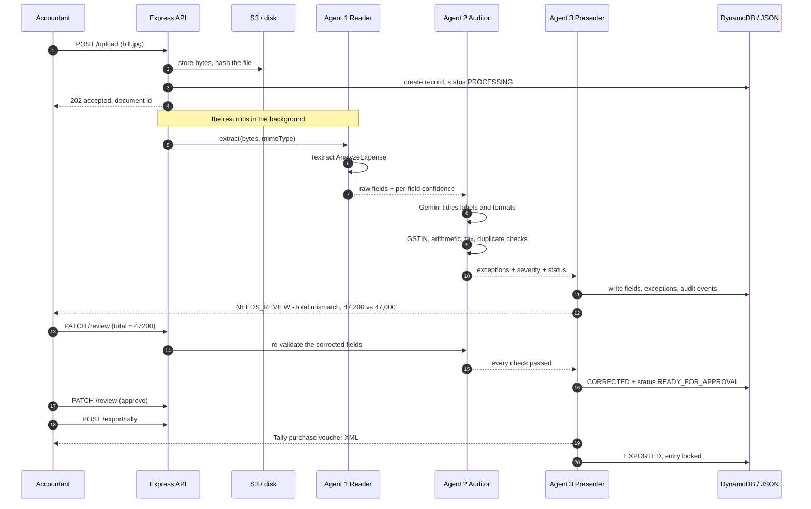

---

## 4. The workflow end to end

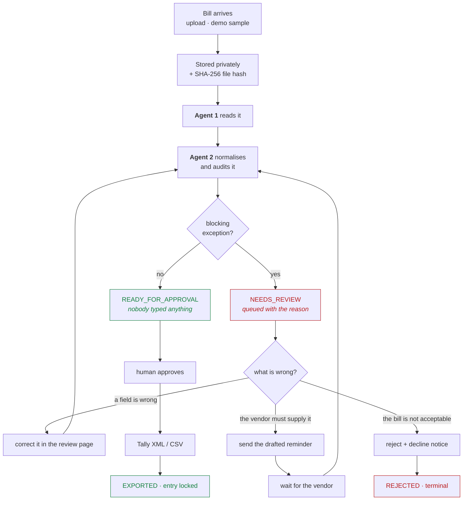

**The document lifecycle**, as enforced by the API:

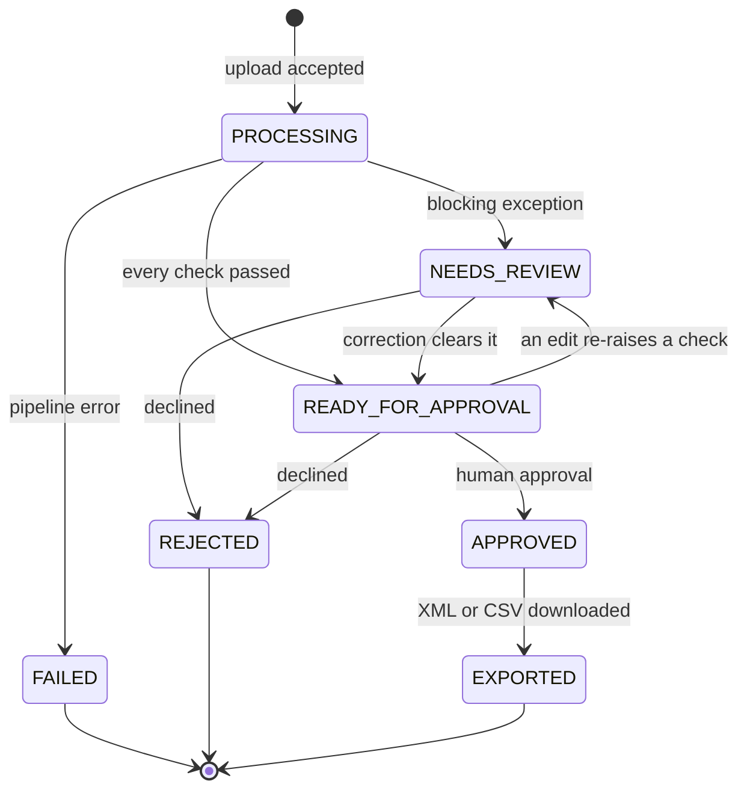

Nothing skips a state. `APPROVED` and `EXPORTED` reject re-extraction, `REJECTED` is terminal, and
every transition lands in the audit trail with the actor who caused it.

---

## 5. The interface

The UI has one job: put the accountant in front of the decision and nothing else. Three screens carry
the whole workflow.

### The inbox — sorted before you arrive

<p align="center">
  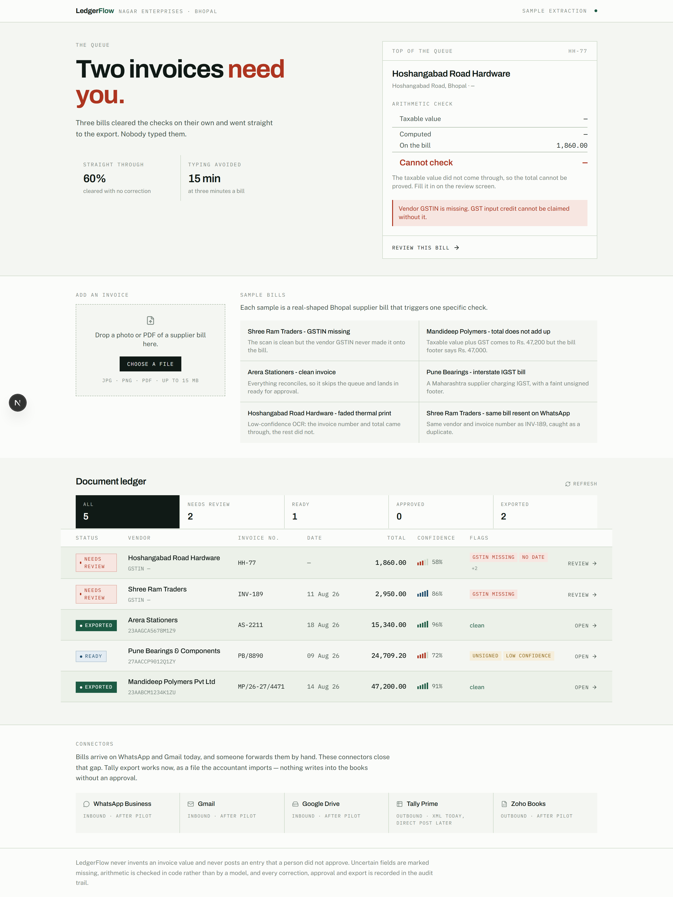
</p>

The headline is a count of decisions, not a count of documents — **"Two invoices need you."** Above the
ledger sit the only two numbers that matter to a firm: what share of bills went **straight through**
with no human touch, and how much **typing was avoided** at three minutes a bill. The badge in the
corner names the extraction engine that actually ran, so nobody mistakes a seeded sample for a live
Textract read.

Each row states its verdict in words a reviewer can act on immediately — *GSTIN missing*, *total does
not add up*, *interstate IGST*, *faded thermal print*, *duplicate resend* — and the tabs
(`NEEDS REVIEW` · `READY` · `APPROVED` · `EXPORTED`) are a work queue rather than a filter. The
connectors rail shows where bills arrive from and where the finished entry goes.

### The review page — one bill, one decision

<p align="center">
  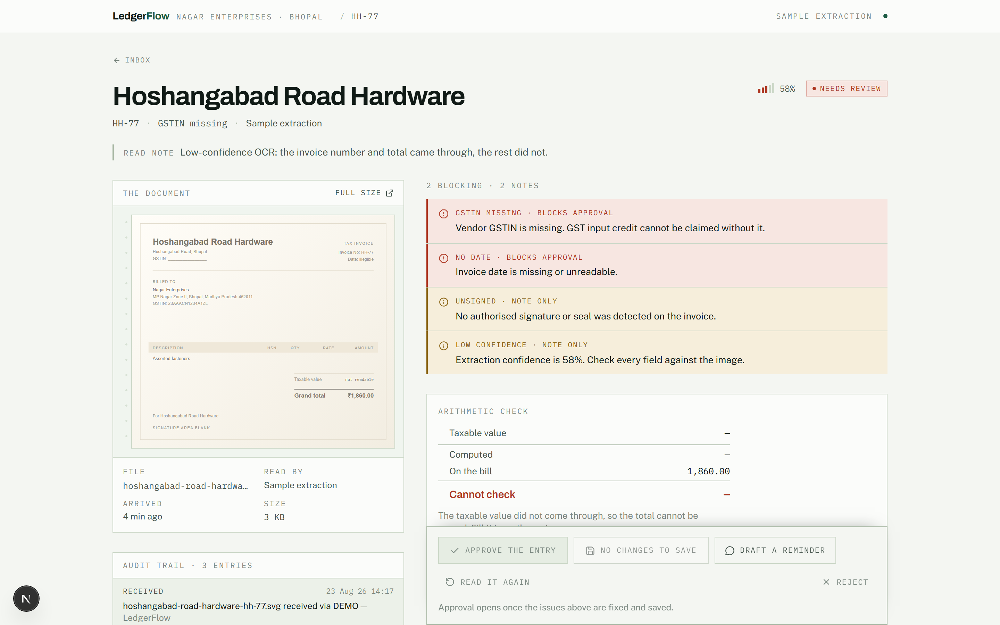
</p>

The document sits beside its verdict. This bill was read at **58% confidence** and carries
**2 blocking · 2 notes**: no GSTIN and no readable date block approval outright, while *unsigned* and
*low confidence* are recorded as notes. The arithmetic panel does not bluff — with the total
unreadable it says **"Cannot check"** rather than showing a green tick over a number nobody proved.

`APPROVE THE ENTRY` is disabled, and the page says why: *approval opens once the issues above are
fixed and saved.* The remaining actions are the four real options — save a correction, draft a vendor
reminder, re-run extraction, or reject. Saving re-runs Agent 2, so a fix clears its own exception
without a page reload.

### Approved and exported — the proof, kept

<p align="center">
  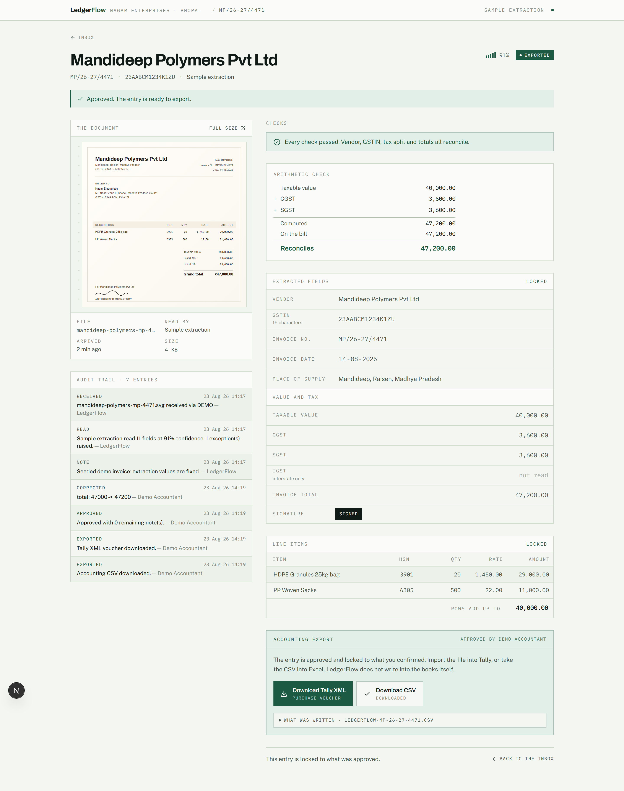
</p>

The same layout after the work is done. **"Every check passed. Vendor, GSTIN, tax split and totals all
reconcile."** The arithmetic is shown rather than asserted — `40,000 + 3,600 + 3,600 = 47,200`,
against the total printed on the bill. Fields are marked **LOCKED**: an exported entry cannot be
quietly edited.

Underneath is the audit trail, and it is the interesting part of this screen. It records
`RECEIVED → READ → NOTE → CORRECTED → APPROVED → EXPORTED`, and the correction is stored as what
actually changed: **`total: 47000 -> 47200`**. Six months later, at filing time, the question "who
changed this figure and why" has an answer. `Download Tally XML` and `Download CSV` are only reachable
from this state.

---

## 6. Architecture

Two deployables and a set of adapters. Every hosted dependency has a local twin, chosen at boot from
the environment — which is why the same code runs on a laptop with no credentials and on AWS with all
of them.

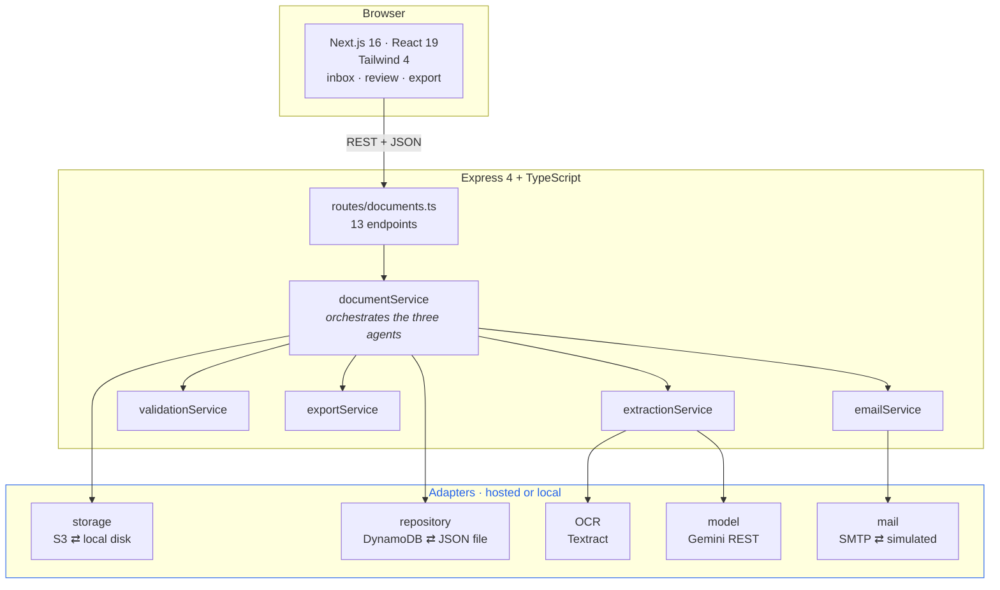

**Every dependency degrades instead of failing.** Nothing in the table below is required to boot, and
`GET /health` reports which side of each row is live.

| Concern | Hosted | Local fallback | Switched on by |
| --- | --- | --- | --- |
| File storage | Amazon S3 (private, signed reads) | `.data/uploads` on disk | `S3_BUCKET` |
| Records | DynamoDB | `.data/documents.json` | `DYNAMODB_TABLE` |
| OCR | Amazon Textract `AnalyzeExpense` | Gemini vision, then seeded samples | AWS credentials, or `ENABLE_TEXTRACT` |
| Model | Google Gemini (`gemini-3.7-flash`) | none — pipeline keeps raw OCR | `GEMINI_API_KEY` |
| Vendor email | SMTP via nodemailer | simulated, written to the audit trail | `SMTP_HOST` + `SMTP_USER` + `SMTP_PASS` |

**And every choice in the stack is there for one reason.**

| Layer | Choice | Why it is here |
| --- | --- | --- |
| Frontend | Next.js 16, React 19, Tailwind 4, lucide-react | The inbox polls while documents process, so both pages are client-rendered |
| API | Express 4, TypeScript 5, Zod | Zod validates both inbound requests and every model response |
| Upload | multer, memory storage, 15 MB cap | Bytes are hashed and stored before anything reads them |
| Extraction | `@aws-sdk/client-textract` | `AnalyzeExpense` returns labelled expense fields, not raw text |
| Model access | plain `fetch` to the Generative Language API | One API key, no SDK, no cloud credential chain |
| Validation | hand-written TypeScript | The verdict must be auditable and reproducible, so no model touches it |
| Export | generated Tally XML + CSV | Tally is what the target firms actually post into |
| API | Express 4, TypeScript 5, Zod | Zod validates both inbound requests and every model response |
| Upload | multer, memory storage, 15 MB cap | Bytes are hashed and stored before anything reads them |
| Extraction | `@aws-sdk/client-textract` | `AnalyzeExpense` returns labelled expense fields, not raw text |
| Model access | plain `fetch` to the Generative Language API | One API key, no SDK, no cloud credential chain |
| Validation | hand-written TypeScript | The verdict must be auditable and reproducible, so no model touches it |
| Export | generated Tally XML + CSV | Tally is what the target firms actually post into |

---

## 7. Run locally

**No AWS account, no API key, no database.** The full three-agent workflow runs on a laptop out of the
box; files land in `.data/uploads/`, records in `.data/documents.json`, and Agent 1 falls to its
`DEMO_FALLBACK` rung with the six seeded Bhopal invoices.

Requirements: **Node.js 20+** and npm.

```bash
# 1 — API
cd backend
cp .env.example .env          # Windows: copy .env.example .env
npm install
npm run seed                  # optional: load the six sample invoices
npm run dev                   # http://localhost:8080

# 2 — dashboard, in a second terminal
cd frontend
cp .env.local.example .env.local
npm install
npm run dev                   # http://localhost:3000
```

Open <http://localhost:3000>. Upload a bill, or load a sample from the upload panel, and watch the
inbox sort itself.

**Confirm what is live** — `/health` answers with the adapter map, so there is never any doubt about
which rung ran:

```bash
curl http://localhost:8080/health
```

```jsonc
{
  "status": "ok",
  "service": "ledgerflow-api",
  "region": "ap-south-1",
  "adapters": {
    "storage": "local",      // "s3" once S3_BUCKET is set
    "repository": "memory",  // "dynamodb" once DYNAMODB_TABLE is set
    "textract": false,       // true when AWS credentials are reachable
    "gemini": false,         // "gemini-3.7-flash" once GEMINI_API_KEY is set
    "email": false           // the notify address once SMTP is configured
  }
}
```

**Turning the real engines on.** Each is one line in `backend/.env`, and each is independent:

| To enable | Add | Effect |
| --- | --- | --- |
| Gemini | `GEMINI_API_KEY=…` from [aistudio.google.com/apikey](https://aistudio.google.com/apikey) | Agent 1 reads real uploads; Agent 2 normalises labels |
| Textract | `aws configure`, or `AWS_PROFILE=…` | Agent 1 promotes to `TEXTRACT_GEMINI` |
| S3 | `S3_BUCKET=…` | Files move off disk into a private bucket |
| DynamoDB | `DYNAMODB_TABLE=…` | Records move off the JSON file |
| Email | `SMTP_HOST` / `SMTP_USER` / `SMTP_PASS` | Vendor reminders are actually delivered |

Other scripts: `npm run typecheck`, `npm run build` then `npm start` (backend); `npm run build` then
`npm start` (frontend).

---

## 8. Configuration

Everything is optional. `backend/.env` is parsed by a Zod schema at boot, so a bad value fails loudly
at startup instead of halfway through an invoice.

| Variable | Default | Purpose |
| --- | --- | --- |
| `PORT` | `8080` | API port |
| `NODE_ENV` | `development` | `development` · `production` · `test` |
| `LOG_LEVEL` | `info` | `debug` · `info` · `warn` · `error` |
| `CORS_ORIGIN` | `*` | Comma-separated allowed origins |
| `ORG_ID` | `demo` | Tenant key on every stored record |
| `MAX_UPLOAD_MB` | `15` | Upload size cap |
| **Model** | | |
| `GEMINI_API_KEY` | — | Turns Agent 1's vision path and Agent 2's normalisation on |
| `GEMINI_MODEL` | `gemini-3.7-flash` | Any Generative Language model id |
| `GEMINI_THINKING_LEVEL` | `low` | `off` · `minimal` · `low` · `medium` · `high` — transcription needs little, and thinking tokens come out of the output budget |
| `ENABLE_GEMINI` | `auto` | `auto` follows the key; `false` forces the demo path |
| **AWS** | | |
| `AWS_REGION` | `us-east-1` | Region for every AWS client |
| `S3_BUCKET` | — | Private bucket for uploaded files |
| `DYNAMODB_TABLE` | — | Document table |
| `ENABLE_TEXTRACT` | `auto` | `auto` enables OCR only when credentials are reachable |
| **Local twins** | | |
| `LOCAL_STORAGE_DIR` | `.data/uploads` | Where files go without S3 |
| `LOCAL_DB_FILE` | `.data/documents.json` | Where records go without DynamoDB |
| **Vendor email** | | |
| `SMTP_HOST` `SMTP_PORT` `SMTP_USER` `SMTP_PASS` | — · `587` · — · — | All three of host/user/pass required; otherwise emails are simulated into the audit trail |
| `EMAIL_FROM` | falls back to `SMTP_USER` | Sender address |
| `VENDOR_NOTIFY_EMAIL` | demo address | Where reminders and decline notices are sent |

Credentials are never read from `.env` in a deployed environment — App Runner and ECS use an IAM
role, which the default AWS credential chain picks up on its own. Uploaded files are stored privately
and only ever served through a short-lived signed URL.

---

## 9. API

Base URL `http://localhost:8080`. Documents live under `/api/documents`. Every response is JSON; every
error is `{ "error": { "code", "message" } }`.

| Method | Path | Does |
| --- | --- | --- |
| `GET` | `/health` | Status plus the live adapter map |
| `GET` | `/api/documents/demo-invoices` | The six seeded samples with what each one teaches |
| `POST` | `/api/documents/upload` | Multipart `file`. Stores + hashes, replies `202` with the record, runs the three agents in the background |
| `POST` | `/api/documents/demo` | Materialise a seeded sample as a real document (`{ "slug": "total-mismatch" }`) |
| `GET` | `/api/documents` | Inbox listing, filterable by status |
| `GET` | `/api/documents/stats` | Straight-through rate, review count, typing minutes avoided |
| `GET` | `/api/documents/:id` | One document: fields, exceptions, audit trail, preview URL |
| `GET` | `/api/documents/:id/file` | Streams the original file bytes, private and non-cacheable |
| `POST` | `/api/documents/:id/process` | Re-run Agents 1 and 2. Refused once `APPROVED` or `EXPORTED` |
| `PATCH` | `/api/documents/:id/review` | `{ action: "SAVE" \| "APPROVE" \| "REJECT", fields?, actor?, reason? }` — `SAVE` re-runs Agent 2 |
| `POST` | `/api/documents/:id/export/tally` | Tally purchase-voucher XML. Requires `APPROVED` |
| `POST` | `/api/documents/:id/export/csv` | Flat accounting CSV. Requires `APPROVED` |
| `POST` | `/api/documents/:id/request-info` | Send the drafted missing-detail request to the vendor |
| `POST` | `/api/documents/:id/reminder` | Send a follow-up reminder for an outstanding request |

Accepted uploads: JPEG, PNG, WebP, TIFF, SVG and PDF, up to 15 MB. Anything else is rejected at the
door with *"Upload a JPG, PNG or PDF."*

```bash
# upload a bill and watch the three agents finish
curl -F "file=@bill.jpg" http://localhost:8080/api/documents/upload
curl http://localhost:8080/api/documents/<id>

# correct the total, which re-runs Agent 2
curl -X PATCH http://localhost:8080/api/documents/<id>/review \
  -H 'content-type: application/json' \
  -d '{"action":"SAVE","fields":{"total":47200},"actor":"Priya"}'

# approve, then export
curl -X PATCH http://localhost:8080/api/documents/<id>/review \
  -H 'content-type: application/json' -d '{"action":"APPROVE","actor":"Priya"}'
curl -X POST http://localhost:8080/api/documents/<id>/export/tally \
  -H 'content-type: application/json' -d '{"actor":"Priya"}'
```

---

## 10. Demo scenarios

Six realistic Bhopal-area supplier bills ship with the project, and between them they exercise every
path through the three agents. They exist so a presentation never depends on a network call: run
`npm run seed`, or load one from the upload panel.

| Sample | What Agent 2 concludes | Why it is in the set |
| --- | --- | --- |
| **Shree Ram Traders** · `INV-189` · ₹2,950 | `GSTIN_MISSING` → **NEEDS_REVIEW** | A perfectly clean scan can still be unpostable. The arithmetic reconciles; input credit is impossible without the GSTIN. |
| **Mandideep Polymers** · `MP/26-27/4471` · ₹47,000 | `TOTAL_MISMATCH` → **NEEDS_REVIEW** | 40,000 + 3,600 + 3,600 = **47,200**, but the footer says 47,000. This is the ₹200 nobody notices until filing. |
| **Arera Stationers** · `AS-2211` · ₹15,340 | no exceptions → **READY_FOR_APPROVAL** | The straight-through case. Nobody types anything; it is waiting to be approved when the accountant opens the inbox. |
| **Pune Bearings** · `PB/8890` · ₹24,709.20 | `SIGNATURE_MISSING` + `LOW_CONFIDENCE` (both notes) → **READY_FOR_APPROVAL** | Interstate: a `27…` Maharashtra GSTIN supplying Bhopal, so IGST-only is correct and CGST/SGST must be zero. Tests the tax-structure rules and the 18% slab on a non-round figure. Warnings alone do not block. |
| **Hoshangabad Road Hardware** · `HH-77` · ₹1,860 | `GSTIN_MISSING`, `INVOICE_DATE_MISSING`, + `LOW_CONFIDENCE`, `SIGNATURE_MISSING` → **NEEDS_REVIEW** | A faded thermal print read at 58%. The invoice number and total survived; nothing else did. Unreadable stays `null` — the arithmetic panel says *cannot check* rather than inventing a subtotal. |
| **Shree Ram Traders** · `INV-189` resend | `DUPLICATE_INVOICE` → **NEEDS_REVIEW** | The same bill forwarded again on WhatsApp. Caught on vendor + invoice number even though the file bytes differ. |

**A two-minute walkthrough.** Open the inbox → the queue is already sorted and the headline names the
number of decisions. Open **Mandideep Polymers** → the arithmetic panel shows the ₹200 gap laid out as
a sum. Correct the total to `47200` and save → Agent 2 re-runs, the exception clears, the status becomes
`READY_FOR_APPROVAL`. Approve, download the Tally XML, and read the audit trail: the correction is
recorded as `total: 47000 -> 47200`, and the entry is now locked. Then open **Hoshangabad Road
Hardware** to see the opposite outcome — approval stays disabled, and the drafted vendor reminder names
exactly the two fields that could not be read.

---

<p align="center">
  <b>LedgerFlow</b> · Team Logorhythms · Claude Impact Lab Hackathon<br/>
  <i>Three agents, one decision, and an audit trail behind every rupee.</i>
</p>
