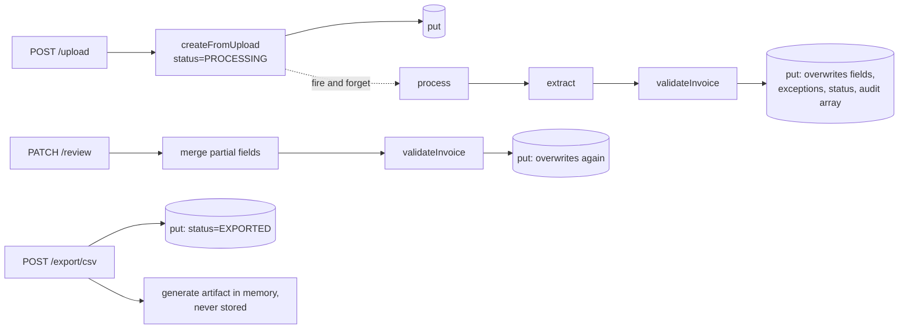

# LedgerFlow system logic redesign

Read against the code on `main`, not against `SYSTEM_ARCHITECTURE.md`. That document describes the
intended production topology and is broadly right. This one describes what the **domain logic**
actually does today, the places where it breaks its own stated rules, and a redesign that makes
those rules structural instead of aspirational.

## 1. Verdict

The adapter layer is genuinely good. `DocumentRepository`, `StorageService`, the Textract → Gemini
→ fallback ladder and the `auto` feature toggles in `config/env.ts` let the same code run on a
laptop and on AWS, and `/health` reports which is live. Keep all of it.

The domain layer is where the problems are, and almost all of them share one root cause:

> **The document is a single mutable row, and every derived fact — status, exceptions, review note,
> audit trail — is stored inside that row and rewritten wholesale on every write.**

`documentService.ts` performs read → spread → `repository.put()` in five places
(`process`, `review`, `markExported`, `reminder`, `requestMissingInfo`) with no version check and no
conditional write. That single pattern produces the lost-update bug, the audit-trail hole, the
"edit an approved invoice" hole, and the inability to answer the one question an auditor actually
asks: *what did the machine read, and what did the human change?*

The redesign below is not a rewrite of the AWS story. It is a change of where truth lives.

## 2. What the code actually does today



Every arrow into a `(put)` is a full-row overwrite of a row that was read earlier, in a different
tick, with no guard that it has not changed since.

## 3. Findings

Ranked by how much damage each can do. Severity is about the accounting record, not about code
aesthetics.

### 3.1 Fabricated extraction is presented as real — critical

`ExtractionService.sampleFallback()` (`backend/src/services/extractionService.ts:161`) picks a demo
invoice by `fileHash` and returns **that demo's vendor name, GSTIN, line items and totals** as the
extraction result for the user's actual file, with the demo's confidence and `failed: false`.

This path fires whenever no extractor is configured, when Textract throws and Gemini is off, and
when Gemini vision throws. If the fabricated data happens to reconcile, the document lands in
`READY_FOR_APPROVAL` and can be approved and exported. The only trace is a free-text `NOTE` audit
line the reviewer is not required to read.

That contradicts README's "uncertain values are treated as missing — not guessed" and
non-negotiable rule 2. It is the difference between a demo safety net and a system that invents a
supplier's GSTIN.

Related: `failed: true` is never produced anywhere in the codebase (verified by grep), so
`EXCEPTION_CODES.EXTRACTION_FAILED` and its `BLOCKING` severity in `validationService.ts:50` are
unreachable dead code. The system has no honest way to say "I could not read this."

### 3.2 An approved document can still be edited — critical

`DocumentService.review()` (`documentService.ts:294`) refuses only `EXPORTED` and `PROCESSING`
(:300–305). A `SAVE` on an `APPROVED` document therefore falls straight through, merges the new
fields, and re-derives status — while `approvedAt` and the `APPROVED` audit event stay in place
(:412). The document can then be re-approved or exported carrying values nobody approved.

`SYSTEM_ARCHITECTURE.md:169` states "`APPROVED` and `EXPORTED` cannot be edited." The code does not
enforce it.

### 3.3 Lost updates silently destroy the audit trail — critical

Two writers on one document — two reviewer tabs, or the 2-second review poll racing a save, or
background extraction landing while a reviewer saves — both read the same row and both call `put()`
with their own copy of the whole document, `audit` array included. The later write wins entirely.
Audit events are appended in application memory, so **a concurrent write drops events that were
already recorded.** An append-only log stored as an overwritable array is not append-only.

There is no `version`, `seq`, ETag or `If-Match` anywhere; `reviewRequestSchema`
(`types/document.ts:136`) carries no expected-version field, and the frontend never sends one.

### 3.4 The frontend discards reviewer edits mid-typing — high

`app/documents/[id]/page.tsx` polls `load()` every 2 s while status is `PROCESSING` (:79–83), and
`load()` resets `draft` unless `keepDraft` is set (:64) — but **no caller ever passes `keepDraft`**,
so the escape hatch that exists for exactly this problem is dead code.

The reachable path: a reviewer corrects a few fields, then clicks "retry extraction" (:154). Status
goes to `PROCESSING`, the 2-second poll starts, and the first tick discards their edits without
warning. There is also no `AbortController` and no request-generation guard anywhere, so a slow
`load()` can install an older document over a newer mutation response — on the inbox too (`page.tsx:29`).

### 3.5 Exports prove nothing — high

`markExported()` (`documentService.ts:428`) flips status and appends an audit line, then the route
generates the CSV/XML in memory and returns it. The artifact is **never stored and never hashed**,
and the guard admits `EXPORTED` as well as `APPROVED` (:434), so every re-click appends another
`EXPORTED` audit event. There is no `ExportRecord`, no idempotency key, and no link from the
artifact back to the approval it came from. An auditor cannot be shown what was handed to Tally.

### 3.6 One tenant per deployment — high

`config.orgId` is a single env var (`config/env.ts:18`, default `'demo'`) read directly inside the
service in nine places. There is no session, no actor identity, and no authorization check anywhere
in `routes/documents.ts`. `ACTOR` is hardcoded to `'Demo Accountant'` in the frontend
(`app/documents/[id]/page.tsx:39`) and is what lands in the audit trail and in the Tally
`NARRATION` as approver — so the audit trail cannot distinguish reviewers even in the demo.

`GET /api/documents/:id/file` streams original invoice bytes to anyone holding the id, with
`CORS_ORIGIN` defaulting to `*`. `orgId` also leaks into the export as Tally's `SVCURRENTCOMPANY`
(`exportService.ts:168`), which currently emits the literal string `demo`.

### 3.7 Rejected documents can be resurrected — medium

`process()` refuses only `APPROVED` and `EXPORTED` (`documentService.ts:135`). `POST /:id/process`
on a `REJECTED` document re-extracts it and moves it back to `NEEDS_REVIEW`, despite `REJECTED`
being documented as terminal. Status transitions are ad-hoc `if` chains in three separate methods
rather than one transition table, which is why holes like this are easy to miss.

### 3.8 A valid multi-rate invoice is blocked — medium

`validationService.ts:213–228` computes one blended effective GST rate over the whole invoice and
raises `TAX_MISMATCH` (`BLOCKING`) when it is not within 0.6 of a standard slab. Any legitimate
invoice mixing 5% and 18% lines produces a blended rate that is not a slab, so it is blocked. The
rate check belongs per line item (via HSN), and at `WARNING` severity.

Two smaller rule problems: `hasSignature` is only ever populated on the Gemini-vision path, so
`SIGNATURE_MISSING` fires or does not depending on which engine ran; and `LOW_CONFIDENCE` is
re-raised on every review from the stored document-level `confidence`
(`documentService.ts:366`), so it never clears no matter how carefully a human verifies the fields.

### 3.9 Severity is compiled in, and never recorded — medium

The `SEVERITY` map (`validationService.ts:35`) is a module constant. There is no org rule set, and
no `ruleSetVersion` is stored on the document or on the approval. Change one severity later and you
have silently rewritten the justification for every historical approval. `SYSTEM_ARCHITECTURE.md:220`
promises versioned rules; nothing implements them.

### 3.10 Business logic is duplicated in the frontend — medium

`lib/types.ts:1` admits it hand-mirrors `backend/src/types/document.ts`, and it has already drifted:
`InvoiceException.code` is a bare `string` where the backend has a closed enum. Worse, several rules
are re-implemented client side and must be kept in agreement by hand:

| Frontend | Duplicates |
| --- | --- |
| `ReconciliationProof.tsx:23` — `Math.abs(delta) <= 1` | `money.ts:2` `AMOUNT_TOLERANCE` |
| `format.ts:126` — `taxableValue`, `taxTotal` fallback | `validationService.ts:159–160` |
| `[id]/page.tsx:90` — `blocking` gate on Approve | `documentService.ts:379` |
| `QueueHero.tsx:80` — hardcoded "at three minutes a bill" | `MINUTES_PER_MANUAL_ENTRY` |
| `format.ts:153` — `EXCEPTION_RANK` triage order | nothing; queue priority exists only in the UI |

If the frontend's tolerance and the backend's ever diverge, the UI will show "Reconciles" on a
document the backend refuses to approve.

### 3.11 Every read scans the whole org — low, but it will bite

`GET /api/documents` runs `list()` **and** `stats()` (`routes/documents.ts:98`), and `stats()` loads
every document for the org and counts in JavaScript (`documentService.ts:253`). No route passes a
limit; there is no pagination or cursor anywhere; the frontend re-runs this every 3 s while anything
is processing. `minutesSaved` also counts rejected and failed documents as time saved.

### 3.12 Processing is not durable — low today, high in production

`processInBackground()` (`documentService.ts:210`) is a fire-and-forget promise. A deploy, crash or
App Runner scale-in during extraction leaves the document in `PROCESSING` forever: there is no
lease, no timeout, no reaper and no retry budget. The frontend polls a state that will never change.

### 3.13 Two concrete hygiene items

- `backend/.data/documents.json` is **tracked in git** (13 KB of document records). `.gitignore:11`
  ignores `backend/.data/`, but an ignore rule does not apply to an already-tracked path, so the
  comment two lines above it — "Customer documents must never reach the repository" — is not being
  enforced. Needs `git rm --cached`.
- `image/svg+xml` is an accepted upload type (`routes/documents.ts:16`) and is streamed back inline
  with its own content type. SVG carries script. Upload MIME is also taken from the client
  (`file.mimetype`) with no magic-byte sniffing.
- `VENDOR_NOTIFY_EMAIL` defaults to a personal Gmail address (`config/env.ts:45`) and **all** vendor
  mail goes to that one address — there is no vendor contact model, so "email the vendor" emails the
  developer.

## 4. The redesign

### 4.1 One principle

**Store facts. Derive state.**

A fact is something that happened and cannot un-happen: a file arrived, an engine proposed values, a
human edited values, a human decided, an artifact was produced. Facts are immutable and appended.

State — `status`, `exceptions`, `reviewNote`, `blocking` — is a **pure function of the facts plus the
org's rule set**. It is never authored, never merged, and never the thing a writer overwrites.

Every finding in section 3 above is a consequence of storing derived state. Section 4.3 shows how
this one change closes 3.2, 3.3, 3.7 and 3.9 without a single explicit guard.

### 4.2 The fact model

Replace the one mutable `InvoiceDocument` with an intake record plus four append-only streams. All
of it still fits the existing single-table DynamoDB layout — these are new sort keys under the same
`ORG#<org>` partition, so the repository interface grows rather than changes.

```text
Document          intake facts only, written once, never updated
  documentId, orgId, source, fileName, mimeType, fileSize, fileHash,
  storageKey, receivedAt, receivedBy, replacesDocumentId?

Extraction        one per attempt              SK  DOC#<id>#EXTR#<attempt>
  attempt, engine, outcome: OK | FAILED, proposed: FieldSet | null,
  rawArtifactKey, engineNotes[], at

Revision          one per human edit           SK  DOC#<id>#REV#<seq>
  seq, parentSeq, basedOnAttempt, fields: FieldSet, actorId, at, changeSet[]

Decision          one per approve/reject       SK  DOC#<id>#DECI#<at>
  verdict: APPROVE | REJECT, pinsRevisionSeq, ruleSetVersion,
  exceptionsAtDecision[], actorId, reason, at

Export            one per artifact             SK  DOC#<id>#EXPO#<id>
  decisionId, format, artifactKey, artifactSha256, idempotencyKey,
  actorId, at, delivery: PENDING | SENT | ACKNOWLEDGED | FAILED

Communication     one per vendor message       SK  DOC#<id>#COMM#<at>
  channel, vendorId, to, template, providerMessageId,
  state: QUEUED | ACCEPTED | DELIVERED | BOUNCED | FAILED, at
```

`Vendor` and `RuleSet` become first-class org-scoped records (`VENDOR#<id>`, `RULESET#<version>`),
as `SYSTEM_ARCHITECTURE.md:135` already anticipated.

The audit trail stops being an array inside a row and becomes a **projection over these streams**.
Nothing can drop an audit event, because nothing rewrites the list.

### 4.3 Status becomes a function

```ts
// pure: no I/O, fully testable, the only place status is decided
function deriveState(f: DocumentFacts, rules: RuleSet, dupes: DuplicateHits): DocumentState
```

with the transition logic expressed once, as an ordered table:

| Condition (first match wins) | Status |
| --- | --- |
| latest `Decision.verdict === REJECT` | `REJECTED` |
| any `Export` exists | `EXPORTED` |
| latest `Decision.verdict === APPROVE` and `pinsRevisionSeq === head.seq` | `APPROVED` |
| latest `Decision.verdict === APPROVE` and `pinsRevisionSeq < head.seq` | `APPROVAL_SUPERSEDED` |
| an extraction lease is held and unexpired | `PROCESSING` |
| latest `Extraction.outcome === FAILED` and retry budget spent | `FAILED` |
| `blocking.length > 0` | `NEEDS_REVIEW` |
| no extraction yet | `RECEIVED` |
| otherwise | `READY_FOR_APPROVAL` |

Read the third and fourth rows again — that is finding 3.2 fixed by construction. "Approved" is not
a flag someone forgot to clear; it means *the decision pins the revision that is still head*. Save
an edit after approval and the document becomes `APPROVAL_SUPERSEDED` automatically, and export
(which requires a `Decision` pinning head) refuses it. No guard needed, and no way to forget one.

`REJECTED` first in the table plus a command precondition makes 3.7 impossible. Deriving exceptions
from the current rule set, with `ruleSetVersion` frozen into each `Decision`, is 3.9.

### 4.4 Field provenance

The single biggest missing concept. Today a field is a bare value, so the system cannot distinguish
"OCR read ₹41,300" from "the accountant typed ₹41,300", and cannot answer the auditor's actual
question. Replace `InvoiceFields` values with:

```ts
type Provenance = 'OCR' | 'MODEL' | 'HUMAN' | 'ABSENT';

interface Attested<T> {
  value: T | null;
  provenance: Provenance;
  confidence: number | null;         // null for HUMAN and ABSENT
  evidence?: { page: number; bbox: [number, number, number, number] };
}
```

This pays for itself immediately:

- **3.1 becomes expressible.** A failed extraction is `provenance: 'ABSENT'` across the board plus a
  blocking `EXTRACTION_FAILED`. There is no shape in which fabricated values can be stored without
  claiming a provenance they do not have.
- **3.8's `LOW_CONFIDENCE` clears properly.** The rule applies only to fields still at `OCR`/`MODEL`
  provenance. Once a human attests a field, it stops being low-confidence — which is what a reviewer
  already believes is happening.
- Per-field confidence replaces one document-level number, so `LOW_CONFIDENCE` can point at the
  field to check instead of saying "check every field against the image."
- `evidence` gives the review UI click-to-highlight on the original, which is the single highest-value
  UI improvement available and is impossible without stored bounding boxes.

### 4.5 Commands, and one concurrency rule

Every write goes through one command handler with the same five steps, in this order:

```
authorize(ctx, capability) → load facts → derive current state
  → check precondition → append fact (conditional write) → rewrite projection
```

| Command | Capability | Precondition |
| --- | --- | --- |
| `IngestDocument` | `intake:write` | verified MIME + magic bytes, size, scan clean |
| `RunExtraction` | worker | lease acquired; `attempt` not already recorded |
| `SaveRevision` | `review:write` | `expectedRevisionSeq === head.seq`; status not terminal |
| `Decide(APPROVE)` | `decide:approve` | `pinsRevisionSeq === head.seq`; zero blocking exceptions |
| `Decide(REJECT)` | `decide:approve` | status not `EXPORTED`; reason present |
| `RequestVendorInfo` | `review:write` | vendor contact resolved |
| `CreateExport` | `export:write` | `APPROVED`; idempotency key unused or replays |
| `RecordDelivery` | worker | export exists |

**The concurrency rule:** every document carries a monotonic `seq`, and every append is a DynamoDB
conditional write on `attribute_not_exists(SK)` for the new fact plus `seq = :expected` on the
projection. A stale writer gets a `409 STALE_REVISION` carrying the current head, and the UI offers a
reload — instead of silently winning. That is 3.3, and it is the smallest change with the largest
correctness payoff.

Note the asymmetry to preserve: `SaveRevision` and `Decide` are **separate commands**. Today
`PATCH /review` merges fields and approves in one call (`documentService.ts:379–412`), which means
approving is an edit. Splitting them is what lets approval pin a revision the reviewer has actually
seen rendered.

### 4.6 An honest extraction contract

Change the return type so silence is not an option:

```ts
type ExtractionOutcome =
  | { ok: true;  engine: RealEngine; fields: AttestedFields; rawArtifactKey: string }
  | { ok: false; engine: RealEngine | 'NONE'; reason: ExtractionFailure; detail: string };

type ExtractionFailure =
  | 'NO_ENGINE_CONFIGURED' | 'UNSUPPORTED_MEDIA' | 'ENGINE_ERROR'
  | 'ENGINE_TIMEOUT' | 'UNREADABLE_DOCUMENT';
```

Rules for the fallback ladder:

1. Textract → Gemini normalization → Gemini vision stays exactly as it is. It is a good ladder.
2. The bottom rung changes. `sampleFallback()` may run **only** when `source === 'DEMO'`, i.e. the
   document was created by `POST /demo` from a known slug. It is then honest: the demo's fields are
   the demo's fields.
3. For a real upload with no engine available, return `{ ok: false, reason: 'NO_ENGINE_CONFIGURED' }`.
   The document derives to `NEEDS_REVIEW` with a blocking `EXTRACTION_FAILED` and empty attested
   fields, and the reviewer types the invoice. Slower, and true.
4. If a demo-style walkthrough on a laptop is still wanted, gate it behind an explicit
   `DEMO_EXTRACTION=true` **and** stamp the document `syntheticExtraction: true`, which derives a
   permanent blocking exception and makes `CreateExport` refuse. A synthetic extraction must never be
   one click away from a Tally voucher.

`/health` should report the demo flag alongside the adapters, so it is visible that a deployment is
in synthetic mode.

### 4.7 Rules as data, not as a constant map

Split a rule's **evaluation** (pure, deterministic, always runs) from its **severity** (org policy):

```ts
interface Rule { code: ExceptionCode; evaluate(f: AttestedFields, ctx: RuleContext): Finding | null }

interface RuleSet {
  orgId: string;
  version: number;                                    // frozen into every Decision
  policy: Record<ExceptionCode, 'BLOCKING' | 'WARNING' | 'OFF'>;
  params: { amountTolerance: number; lowConfidence: number; allowFutureDates: boolean };
}
```

Consequences worth calling out:

- `AMOUNT_TOLERANCE` moves from `money.ts:2` into `params`, and ships to the client in the
  document read model. That deletes the duplicated `Math.abs(delta) <= 1` in
  `ReconciliationProof.tsx:23` — the UI renders the tolerance it was given rather than its own copy.
- A firm not claiming input credit can set `GSTIN_MISSING: 'WARNING'` instead of the code deciding
  for every firm.
- `TAX_MISMATCH` (3.8) is re-specified: infer the rate **per line item** from HSN where available,
  raise per-line findings, and set the blended-rate check to `WARNING`. Blocking on a mixed-rate
  invoice is a false positive that trains reviewers to click through warnings.
- `SIGNATURE_MISSING` only evaluates when `hasSignature.provenance !== 'ABSENT'`, so it stops
  depending on which engine ran.

### 4.8 Durable processing, without adopting SQS yet

Keep the in-process worker for now, but give it the two properties that make it swappable:

```text
ProcessingLease   SK  DOC#<id>#LEASE
  attempt, workerId, acquiredAt, leaseUntil, attemptsUsed
```

- `RunExtraction` acquires the lease with a conditional write. A second worker cannot double-extract.
- A reaper sweeps expired leases and either re-enqueues or, once the retry budget is spent, appends a
  `FAILED` extraction. **No document can sit in `PROCESSING` forever** — 3.12.
- The interface is `enqueue(documentId, attempt)`. Today it is `setImmediate`; tomorrow it is
  `SendMessage` to SQS with a DLQ, and no domain code changes.

### 4.9 Identity threaded, not configured

Delete `config.orgId` from the service layer entirely. Introduce one context object resolved by
middleware and passed as the **first argument to every service method**:

```ts
interface RequestContext {
  actorId: string;
  actorName: string;         // for display; actorId is what audit records
  orgId: string;
  capabilities: Set<Capability>;
  requestId: string;
}
```

This is mechanical — nine call sites — and it is the change that makes tenancy real rather than
aspirational. Do it before any auth provider is chosen: a hardcoded dev context that returns
`{ orgId: 'demo', actorId: 'dev' }` is fine, because the *shape* is what matters. Once the argument
exists, adding Cognito or Auth.js later touches only the middleware.

Alongside it:

- Authorize `GET /:id/file` and `GET /:id` on `ctx.orgId`, and serve previews only through
  short-lived signed URLs or an authorized stream (3.6).
- Drop `image/svg+xml` from accepted uploads, or rasterize on ingest. Sniff magic bytes rather than
  trusting `file.mimetype`.
- `ACTOR` disappears from the frontend. The audit actor is `ctx.actorId`, server side, always. A
  client cannot name itself in the audit trail.
- Tally's `SVCURRENTCOMPANY` takes the org's configured company name, not `orgId`.

### 4.10 Vendors and communications

```text
Vendor  SK VENDOR#<id>   gstin?, name, aliases[], emails[], phone?, defaultPlaceOfSupply?
```

Resolve a vendor on extraction: GSTIN exact match first, then normalized-name match reusing the
existing `normalizeVendor()` in `utils/hash.ts:30`. Vendor mail goes to that vendor's contacts, and
`RequestVendorInfo` requires a resolved contact — no global default recipient, and the personal Gmail
default in `config/env.ts:45` goes away.

Delivery becomes a state, not a boolean. `EmailResult.delivered` currently conflates "SMTP accepted
it" with "the vendor received it," and the route text at `routes/documents.ts:182` is careful about
this in prose while the data model is not. Store `providerMessageId` and a
`QUEUED → ACCEPTED → DELIVERED | BOUNCED` state fed by provider webhooks.

Also fold the two near-identical paths together: `reminder()` and `requestMissingInfo()`
(`documentService.ts:462` and `:507`) both re-run validation to recompute `missingFields` and differ
only in channel. One `RequestVendorInfo` command with a `channel` parameter and a template id.

### 4.11 Exports that can be audited

- `CreateExport` requires an `Idempotency-Key`. A repeat returns the existing `Export` and its stored
  artifact byte-for-byte. Two clicks produce one export record — 3.5.
- Generate once, write the artifact to S3, store `artifactSha256`. The download endpoint serves the
  stored artifact, so what the auditor fetches next year is what Tally received.
- `Export.decisionId` binds the voucher to the approval, and the approval pins a revision. That chain
  — original bytes → extraction → revision → decision → artifact hash — is the acceptance criterion
  at `SYSTEM_ARCHITECTURE.md:328`, and it is only closable with the fact model in 4.2.
- `EXPORTED` derives from an export record existing, so no code path sets it.

### 4.12 Reads: projections and cursors

- Keep one `DocumentProjection` item per document (status, head fields, exception summary, vendor,
  amounts, `seq`), rewritten in the same transaction as each appended fact. The inbox reads
  projections only — never the fact streams.
- Maintain per-org **counters** in a single `ORG#<org> | STATS` item, incremented on transition. That
  removes the full-org scan on every 3-second poll (3.11).
- Cursor pagination on `GET /documents` (`limit` + opaque `cursor`), server-side status and
  assignee filters, and server-side queue ordering — which also gives `EXCEPTION_RANK`
  (`format.ts:153`) a home in the backend, where the priority policy belongs.
- `minutesSaved` counts only exported documents, or is removed. Counting failed and rejected
  documents as time saved is a metric that will be challenged in the first customer conversation.

### 4.13 Frontend contract

The frontend's problems are downstream of the backend's, and mostly dissolve once the read model
carries derived state and a `seq`:

- **Share the contract instead of mirroring it.** Move the Zod schemas to a `shared/` workspace
  package and have `frontend/lib/types.ts` re-export inferred types. Validate responses with the
  schema in `api.ts:55` instead of casting. That removes the already-present drift (3.10).
- **Send `expectedRevisionSeq`** on save and `pinsRevisionSeq` on approve. Handle `409` by showing
  "this invoice changed while you were editing" with a diff, rather than overwriting.
- **Fix the poll clobbering edits** (3.4) now, independent of everything else: poll a lightweight
  `GET /documents/:id/state` that returns `{ status, seq }` and only re-`load()` when `seq` changes,
  and never reset `draft` while the field editor is dirty. Add an `AbortController` and a request
  generation counter so a slow response cannot install stale data.
- **Send diffs, not the whole draft.** `apply()` currently posts the entire field set
  (`[id]/page.tsx:104`), so a stale tab reverts another reviewer's corrections even for fields it
  never touched.
- **Render policy, don't reimplement it.** Tolerance, exception severity, queue rank and the
  minutes-per-entry constant all arrive from the API. The Approve button reflects
  `state.blocking.length`, and the backend remains the enforcer.
- Wire the existing `DeclineModal` to collect a real rejection reason instead of the hardcoded string
  at `[id]/page.tsx:415`.

## 5. Migration order

Each step is independently shippable and leaves the demo working. The order is chosen so the
highest-severity findings close first and no step depends on a later one.

| # | Step | Closes | Effort |
| --- | --- | --- | --- |
| 1 | `git rm --cached backend/.data/documents.json`; drop SVG uploads; sniff magic bytes | 3.13 | minutes |
| 2 | Make extraction failure representable: `ExtractionOutcome` union, demo fallback gated to `source === 'DEMO'`, `EXTRACTION_FAILED` reachable | 3.1 | hours |
| 3 | Add `seq` + conditional writes; `409 STALE_REVISION`; frontend sends expected seq and stops resetting a dirty draft | 3.3, 3.4 | 1 day |
| 4 | Introduce `RequestContext` and thread it; delete `config.orgId` from services; authorize `/file`; move actor server side | 3.6 | 1 day |
| 5 | Split `Revision` from `Decision`; move status/exceptions into a pure `deriveState()`; transition table | 3.2, 3.7 | 2 days |
| 6 | `Export` records with idempotency keys, stored artifacts and hashes | 3.5 | 1 day |
| 7 | `RuleSet` as data with `version` and `policy`; per-line rate check; provenance-aware `LOW_CONFIDENCE` | 3.8, 3.9 | 2 days |
| 8 | Field provenance (`Attested<T>`) and per-field confidence; evidence bboxes in the review UI | 4.4 | 2–3 days |
| 9 | Projections, counters, cursor pagination, server-side queue order | 3.11, 3.10 | 1–2 days |
| 10 | Processing leases and a reaper; then swap `enqueue` for SQS + DLQ | 3.12 | 1–2 days |
| 11 | `Vendor` records, real delivery states, one `RequestVendorInfo` command | 4.10 | 1–2 days |

Steps 1–4 are the ones that matter before this touches a real supplier invoice. Steps 1 and 2 alone
remove the possibility of exporting a fabricated GSTIN, which is the difference between a demo and
something that should not be pointed at a customer's mailbox.

## 6. What to keep, and what to delete

**Keep unchanged:** the adapter interfaces and the `auto` toggle design in `config/env.ts`; the
Textract → Gemini → vision ladder; the Gemini prompt constraints and the conservative
`mergeNormalized()` in `geminiService.ts:396` (a model number is accepted only where OCR had
nothing — that is exactly right); `parseAmount()`'s Indian-format handling; the GSTIN checksum;
`invoiceFingerprint()`'s vendor-name-over-GSTIN reasoning; `/health` adapter reporting.

**Delete:** the document-level `confidence` field (superseded by per-field); the `audit` array inside
the document (superseded by fact streams); `MINUTES_PER_MANUAL_ENTRY` or its inclusion of
rejected/failed documents; `sampleFallback()` for non-demo sources; the frontend's `EXCEPTION_RANK`,
tolerance constant and `ACTOR`.

**One-line summary:** the AWS architecture in `SYSTEM_ARCHITECTURE.md` is fine to build toward, but
the domain layer has to stop storing its conclusions before any of that infrastructure can be trusted
to carry them.

